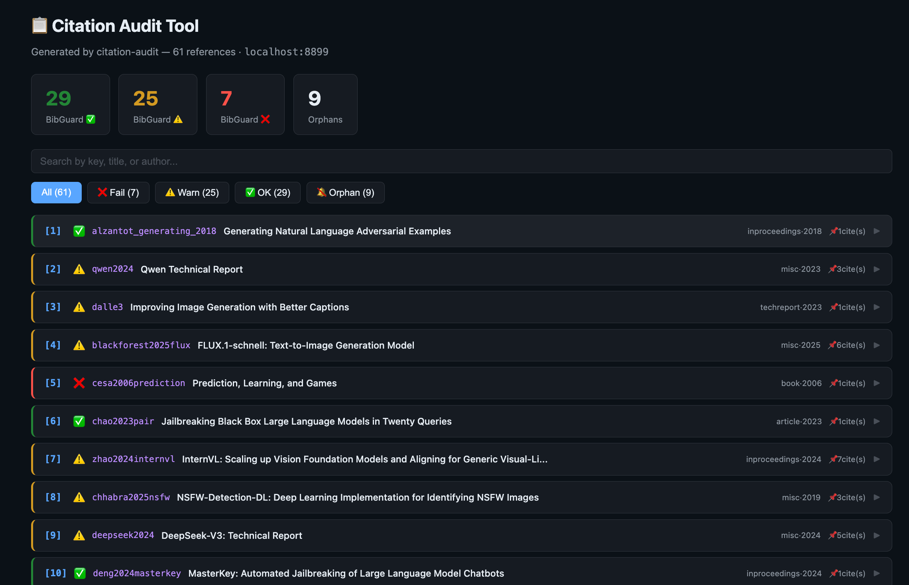
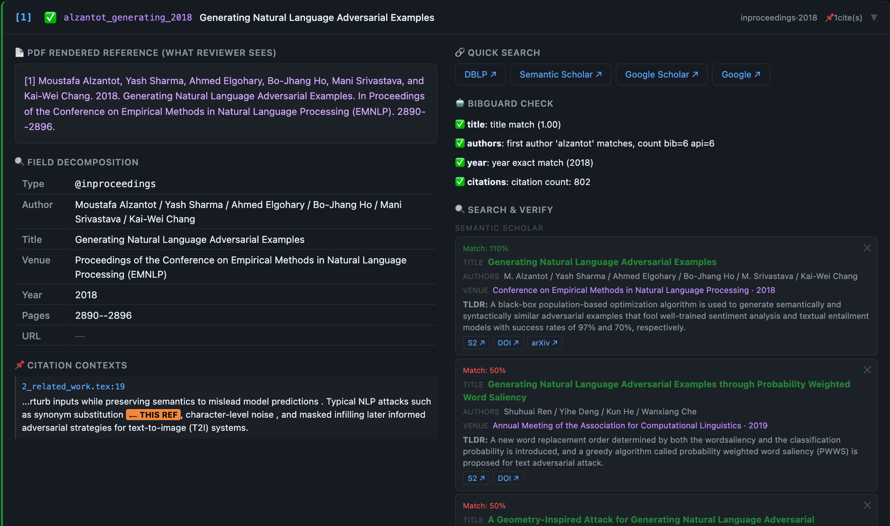

# Citation Audit

> Making manual citation verification easier and more reliable
>
> 让人工检查引用变得更为轻松且可靠

A browser-based tool that helps you verify every reference in your paper before submission. Parses your `.bib`, `.tex`, and `.bbl` files, then generates an interactive HTML page where you can inspect each reference side-by-side with search results from Semantic Scholar and DBLP.

Built for the LLM-assisted writing era, where fabricated or inaccurate citations can lead to desk rejection.





---

## Quick Start (3 steps)

### 1. Install

```bash
git clone https://github.com/haolin3/citation-audit.git
cd citation-audit
pip install -r requirements.txt   # installs bibguard
```

### 2. Set up Semantic Scholar API key (free, optional but recommended)

Get a key at https://www.semanticscholar.org/product/api#api-key-form, then:

```bash
echo 'export S2_API_KEY=your-key-here' >> ~/.zshrc   # or ~/.bashrc
source ~/.zshrc
```

Without a key, Semantic Scholar search will be rate-limited (~10 requests/min). DBLP and Google search work without a key.

### 3. Run

```bash
cd /path/to/your/paper
python3 /path/to/citation-audit/run.py
```

That's it. Auto-detects your files, generates HTML, starts a local server, opens your browser.

---

## What files does it read?

| File | What it provides | Required? |
|------|-----------------|-----------|
| **`.bib`** | Field decomposition (authors, title, venue, year, pages, URL), quick search links, BibGuard checks | **Yes** — won't run without it |
| **`.tex`** | Citation contexts — shows where each ref is cited with ★THIS REF★ highlighting | No — contexts will be empty |
| **`.bbl`** | "PDF rendered reference" — the exact text the reviewer sees in your References section | No — that section will be empty |

**Minimum to run: just a `.bib` file.**

### How to get a `.bbl` file

The `.bbl` is generated when you compile your LaTeX paper:

```bash
pdflatex paper.tex
bibtex paper
pdflatex paper.tex
pdflatex paper.tex
```

If you've already compiled your paper, the `.bbl` file is already there.

---

## What each card shows

```
┌─────────────── Left (your paper) ──────────────┐  ┌──────── Right (verification) ────────┐
│                                                 │  │                                      │
│ 📄 PDF rendered reference                       │  │ 🔗 Quick search                      │
│    (what reviewer actually sees)                │  │    DBLP / S2 / Google Scholar /       │
│                                                 │  │    Google / arXiv / Original URL      │
│ 🔍 Field decomposition                          │  │                                      │
│    Type / Author / Title / Venue /              │  │ 🤖 BibGuard check                    │
│    Year / Pages / URL                           │  │    Automated field-by-field results   │
│                                                 │  │                                      │
│ 📌 Citation contexts                            │  │ 🔍 Search & verify                   │
│    "...FLUX.1-schnell ⟵THIS REF ..."           │  │    One-click DBLP + S2 search,        │
│    (windowed around the citation)               │  │    shows top 3 results from each      │
│                                                 │  │    with match %, TLDR, links          │
└─────────────────────────────────────────────────┘  └──────────────────────────────────────┘
```

---

## Command line options

```bash
python3 run.py [paper_dir] [options]

# Defaults to current directory
python3 run.py

# Specify a directory
python3 run.py ~/papers/my-paper

# English output
python3 run.py --lang en

# Different port
python3 run.py --port 9000

# Specify a .bib file (if auto-detection picks the wrong one)
python3 run.py --bib custom.bib

# Only generate HTML, don't start server
python3 run.py --generate-only

# Don't open browser automatically
python3 run.py --no-open
```

---

## Adapting for different LaTeX templates

**Most of the tool works with any LaTeX template** — `.bib` parsing, `.tex` context extraction, BibGuard, and all search features are universal.

**The only template-specific part is `.bbl` parsing** — the function `parse_bbl()` in `generate.py`. It currently handles ACM's `ACM-Reference-Format.bst` output.

Open `generate.py` and look for:

```python
def parse_bbl(bbl_path):
    """
    ┌──────────────────────────────────────────────────────────────┐
    │  TEMPLATE-SPECIFIC — this is the only function you need to  │
    │  adapt for a different LaTeX template.                       │
    │  ...                                                         │
    └──────────────────────────────────────────────────────────────┘
    """
```

### For non-ACM templates (IEEE, USENIX, Springer, etc.)

Non-ACM `.bbl` files are usually simpler — plain text after `\bibitem{key}`:

```
\bibitem{key1}
Author1, Author2. Title. In Venue, Year. Pages 1--10.

\bibitem{key2}
...
```

To adapt, replace the regex and remove ACM-specific cleanup commands (`\bibfield`, `\bibinfo`, etc.). The LaTeX accent conversion (ö, é, ñ, etc.) is universal — keep it.

### If you don't want to adapt

Just skip it — run without a `.bbl` file. The "PDF rendered reference" section will be empty, but everything else (field decomposition, citation contexts, BibGuard, search) works normally.

---

## Project structure

```
citation-audit/
├── run.py              ← Entry point: generate + serve + open browser
├── generate.py         ← Core: parse files → produce HTML
├── requirements.txt    ← pip dependencies (bibguard)
├── LICENSE             ← MIT
├── README.md
├── .env.example        ← S2 API key setup instructions
└── .gitignore
```

```
Your paper directory (after running):
├── paper.bib              ← input
├── paper.tex / sec/*.tex  ← input
├── paper.bbl              ← input (optional)
├── citation_audit.html    ← generated output (English)
└── citation_audit_zh.html ← generated output (Chinese)
```

---

## How it works

```
run.py
  │
  ├─ Calls generate.py on your paper directory
  │    ├─ parse_bib()         → field decomposition
  │    ├─ parse_bbl()         → PDF rendered text  (⚠️ template-specific)
  │    ├─ extract_contexts()  → citation contexts from .tex
  │    ├─ run_bibguard()      → automated checks (external tool)
  │    └─ generate_html()     → outputs citation_audit.html
  │
  └─ Starts local server (localhost:8899)
       ├─ Serves the HTML
       ├─ Proxies /api/s2   → Semantic Scholar (injects your API key)
       └─ Proxies /api/dblp → DBLP (no key needed)
```

The server proxy exists because browsers block direct API calls from local HTML files (CORS). Your S2 API key stays local — it's only sent server-side, never exposed in the HTML.

---

## FAQ

**Q: Why do I need a local server? Can't I just open the HTML file?**
A: The "Search & Verify" feature calls Semantic Scholar and DBLP APIs. Browsers block these API calls from `file://` URLs (CORS policy). The local server proxies these requests. If you only need the static content (PDF reference, field decomposition, citation contexts, BibGuard), opening the HTML directly works fine.

**Q: BibGuard takes a long time**
A: BibGuard queries multiple online databases (DBLP, Semantic Scholar, OpenAlex, arXiv, CrossRef) for each entry. 60 entries ≈ 60–90 seconds. This runs once during generation.

**Q: Google Scholar search?**
A: Google Scholar has no API. The quick search link opens Google Scholar in a side window for manual search.

**Q: My `.bbl` file isn't being parsed correctly**
A: The `.bbl` parser is written for ACM format. See [Adapting for different LaTeX templates](#adapting-for-different-latex-templates). Or just skip it — everything else works without `.bbl`.

---

## License

MIT
